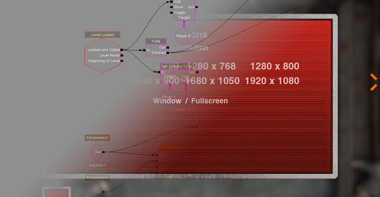
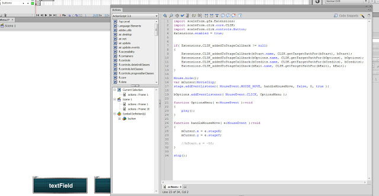
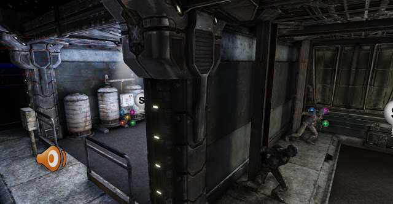
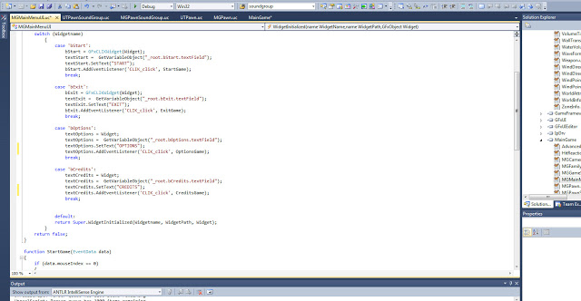

The camera animation is done using matinee which are triggered by Kismet like in the experimentation stages with Scaleform.

I went for a simple UI approach, I focused on making my menu buttons more tangible rather than just text. This feel draws from games like StraCraft where the buttons are a combination of metal and sci-fi parts.

To make the main menu more interesting I added a depth of field blur so only parts of the scene are in focus. This combined with the steam and other particle effects make a very static scene much more interesting.

I tried to minimize the amount of fscommands used in the final menu and instead opted for an Unrealscript approach. Although it was a bit harder to setup, it is more flexible and should be better optimized. The only fscommands used were to initiate the camera movement for the options menu because I could not find a suitable method but it still looks good. Unrealscript also allowed me to manage the changing of screen resolutions easily.

Here is the final menu, the resolution cannot be changed in the video because the screen recording would fail but it does work. The loading screens will be changed closer to the demo release.
